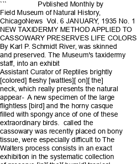

# Voices from the Field

## Introduction

I’ve always been passionate about research and museums. To me, museums are like treasure troves, holding the keys to mysteries and questions about the natural world and the people who shaped it.

At the Field Museum, I’m constantly inspired by the stories behind our oldest specimens and the historic events that have shaped the museum, from its founding during the 1893 World’s Columbian Exposition to the remarkable discoveries that followed.

But uncovering these stories isn’t easy. They’re often hidden in old documents, preserved as PDF files or buried deep in archives—fascinating, but not always accessible.

That’s why I created this project: an AI chatbot that brings the museum’s rich history to life. It’s a way to make the “old” accessible and engaging, letting anyone explore the mysteries of the museum in a fun and interactive way.

I’d love for you to give it a try—and who knows? Maybe I’ll see you at the museum! 

## Scraping 

The documents were easily accessible from the [Biodiversity Heritage Library](https://www.biodiversitylibrary.org). Here is a sample page from a news publication from January, 1935:

## Problems (and solutions) with ingesting text

The problem with old PDF files is that they often were formatted in ways we don't use today, and sometimes the text is not searchable. I tried several ways of extracting text from PDFs.

<!-- ### Trying `pypdf2` -->

First, I used the popular `pypdf2` package in Python. This was really fast, but the problem was that the text often ran together. Here's an example:

> NEWTAXIDERMY METHOD APPLIED TOCASSOWARY PRESERVES LIFECOLORS\nByKarl P.Schmidt\nAssistant Curator ofReptiles\nAnewspecimenofthelarge flightless bird\ncalled thecassowary wasrecently placed...

<!-- <code style="color: darkorange">text</code> -->

<!-- ### Trying `pymupdf4llm` -->

Next up, I tried the `pymupdf4llm` package, which was designed with extracting text from PDFs specifically for use in large language models (LLM), like the chat bot I was designing. Unfortunately, the problem I ran into was that- in many of the PDF files there were multiple columns, and instead of ingesting the text in the correct reading order, the algorithm would read horizontally across a page. Needless to say, this often caused confusion. Here is an example of what I mean (notice the bolded text):

> NEW TAXIDERMY METHOD APPLIED TO CASSOWARY PRESERVES LIFE COLORS\n         By Karl P. Schmidt __River, was skinned and preserved. The__ Museum\'s taxidermy staff, into an exhibit...

<!--  -->

At first I thought, this will be fine, the LLM will figure out what I mean and correctly interpret the texts. But I was wrong. Even AI needs a little help from humans!

<!-- ### Trying `pymupdf` -->

Finally, I tried an alternative, `pymupdf`. To my surprise, it worked really well. There wasn't the problem of missing spaces between words that `pypdf2` had, and the columns were correctly traversed, unlike the specialized `pymupdf4lmm` package. Here is an example of some extracted text:

> NEW TAXIDERMY METHOD APPLIED TO CASSOWARY PRESERVES\nLIFE COLORS\nBy Karl P. Schmidt\nAssistant Curator of Reptiles\nA new specimen of the large flightless bird\ncalled the cassowary was recently...

Now that we have text, onto the next step: embedding!

## Text chunking

A PDF will return a long string of text that can really slow down a LLM. To get around this, I used chunking where we break up the text into predefined chunks. I mentioned that too big of chunks can cause problems (i.e., whole PDFs), but chunks that are too small can also be tricky. Imagine if we just broke up the whole PDF into single characters. For example, "Museums are great" could become: `text = ["M", "u", "s", "e", "u", "m", " ", "a", "r", "e", ...]`, and so on. The problem here is that the AI would have no idea how to figure out how to matchup up a question like "Is the museum great?" given just a bunch of letters. The way that the retrieval-based augmented generation (RAG) process works is by matching up chunks of text to the meaning interpreted from what a person types in. 

So what is the optimum chunk size then? One way to approach this would be to try a bunch of different chunk sizes and see how it affects the way the AI works. I may end up trying this next, but for now I was excited to come across a paper on arxiv by Xiaohua Wang and colleagues ([https://arxiv.org/abs/2407.01219](https://arxiv.org/abs/2407.01219)). The paper is about best practices for chunk sizes in RAG, and I ended up going with their settings (512 characters in a chunk, 20 overlapping characters to capture meaning).

## Embedding

I tried several embedding models available on HuggingFace and implemented in the `SentenceTransformer` package (all-MiniLM-L6-v2, bge-small-en-v1.5, gte-base-en-v1.5). They all gave roughly similar results in terms of retrieiving relevant chunks of text, s.o I decided to stick with a relatively smaller embedding model (all-MiniLM-L6-v2, 384 dimensions) to save space.

## Connecting a LLM

I consider several possible LLMs (GPT-4o, GPT-4o mini, Llama 3, Claude 3.5). Since I wanted to make this free for people to use, I steered away from commercial APIs and instead focused on free LLMs available on huggingface. I landed on the Falcon-7B-Instruct model ([https://huggingface.co/tiiuae/falcon-7b-instruct](https://huggingface.co/tiiuae/falcon-7b-instruct)). This model was good for chat-based applications, was trained on a relatively large data set and had good performance according to HF leaderboards.

## Try it out!

The website is now live as a streamlit app! Feel free to try it out at the following url: [URL pending...]()

## Future steps

1. __Connect a specimen database__: We might be interested in .. how many birds are there? What is the first bird ever collected? Who collected the most specimens? What famous collectors were working in the 1920s?

2. __Compare chunking methods, LLMs__: Other models might perform better

3. __Add metadata__: Right now, the LLM has trouble understanding context about the documents. For example, what year/month they came from. I am thinking of trying regular expressions (or pulling metadata from BHL).